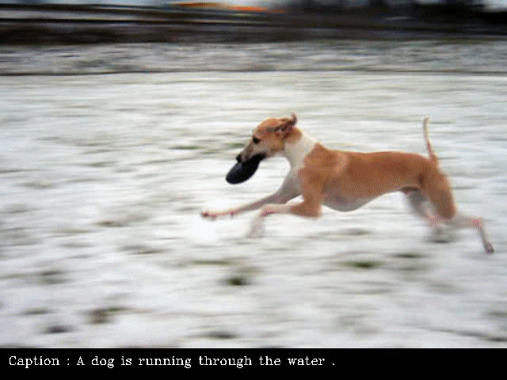

# Image-Captioning

The ability to study the state, properties, and relationship between these objects is required for the meaningful description generation process of high level picture semantics.

## Download Dataset

- Kaggle Dataset [adityajn105/flickr8k](https://www.kaggle.com/adityajn105/flickr8k/download)
## Model Description
- Image Feature extraction using VGG16
- Sentence Feature using LSTM layer
- Concatenate images feature and sentence feature and train Neural Network to predict next word
## Download Trained Model

- Download the model and place it in same folder 
- [https://drive.google.com/file/d/1ylBXRv490XJHIHLmcQ3YklVDzzBX91BT/view?usp=sharing](https://drive.google.com/file/d/1ylBXRv490XJHIHLmcQ3YklVDzzBX91BT/view?usp=sharing)
## Download Vocabulary

- Download the vocabulary and place it in same folder
- [https://drive.google.com/file/d/1-9UQlNl_aP3IWvmQxea6EQdunArkN4uf/view?usp=sharing](https://drive.google.com/file/d/1-9UQlNl_aP3IWvmQxea6EQdunArkN4uf/view?usp=sharing)
## Demo
[**Demo on youtube**](https://www.youtube.com/watch?v=gieG6AQwoH8)
